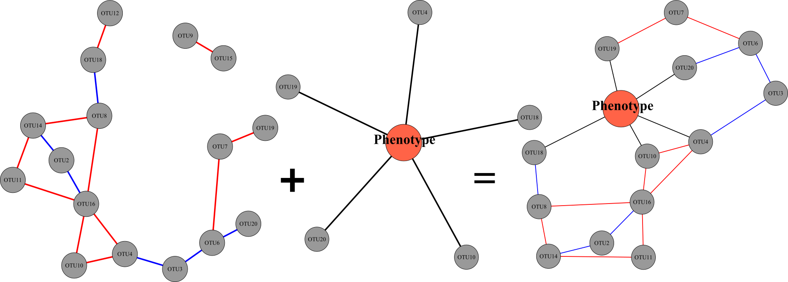

#### Introduction
[](https://zenodo.org/badge/latestdoi/284593130)

PhONA provides a framework to select a testable and manageable number of
OTUs/ASV to support microbiome-based agriculture.

```R
# installation 
library(devtools)
devtools::install_github("ravinpoudel/PhONA", build_vignettes = TRUE, force = TRUE)

# Browse Vignettes to see the output as below. 

browseVignettes("PhONA")

```




**PhONA** is an R package to construct a phenotype-OTU network analysis (PhONA) using ML models (such as regression, GLM, lasso) and network models of sequence-based Operational Taxonomic Units (OTUs/ASVs) and associated phenotype. PhONA takes as input an association matrix defining OTU-OTU relations. This can be defined using correlation or using statistical approaches developed for compositional data (such as SparCC , SPIEC-EASI).Machine learning (ML) is used to define Phenotype-OTU associations. Examples of models available n PhONA are: Regularization models (e.g. lasso), Linear models, etc. Resulting OTU-OTU associations, and Phenotype-OTU associations are combined to create a PhONA plotted using the igraph package. Graphical output can be used to generate hypotheses based on the observed network structures or using prior knowledge about the systems/ OTUs. Additionally, PhONA can also be used for Amplicon sequence variants(ASVs) or in general any count matrix in the format- where rows represent samples and columns represent features ( OTUs, ASVs, Genes, Birds…etc).. 

 
