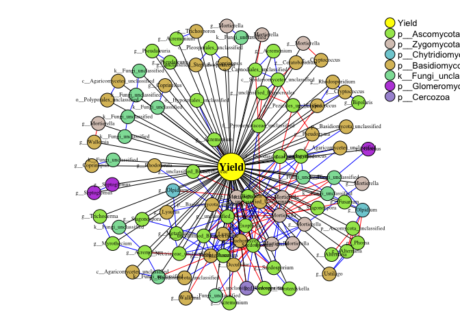
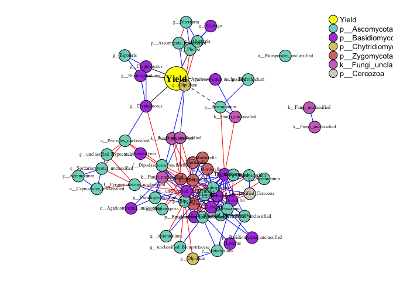

#### Introduction

PhONA provides a framework to select a testable and manageable number of
OTUs to support microbiome-based agriculture

    ###### Load the data
    phyobj <- readRDS(system.file("extdata", "physeqobject.rds", package = "PhONA"))
    sparcc.cor <- read.delim(system.file("extdata", "cor_sparcc.out", package = "PhONA"), sep = "\t", header = T, row.names = 1)
    sparcc.pval <- read.delim(system.file("extdata", "pvals.txt", package = "PhONA"), sep = "\t", header = T, row.names = 1)

    library(PhONA)
    PhONA(
      physeqobj = phyobj,
      cordata = sparcc.cor,
      pdata = sparcc.pval,
      model = "lm",
      OTU_OTU_pvalue = 0.001,
      OTU_OTU_rvalue = 0.6,
      OTU_Phenotype_pvalue = 0.6,
      definePhenotype = "Marketable",
      defineTreatment = "Maxifort",
      coloredby = "Phylum",
      PhenoNodecolor = "yellow",
      PhenoNodesize = 20,
      PhenoNodelabel = "Yield",
      nodesize = 10,
      Pheno2OTUedgecolor = "black",
      netlayout = layout.fruchterman.reingold
    )

    ## IGRAPH e3b2317 UN-- 97 299 -- 
    ## + attr: Kingdom (v/c), Phylum (v/c), Class (v/c), Order (v/c), Family (v/c), Genus (v/c), Species (v/c), color (v/c), name
    ## | (v/c), size (v/n), nName (v/c), vertex.label.size (v/n), vertex.label_type (v/n), relation (e/c), pv (e/c), weight_1 (e/n),
    ## | weight_2 (e/n), color_1 (e/c), color_2 (e/c), lty_1 (e/n), lty_2 (e/n), color (e/c), lty (e/n)
    ## + edges from e3b2317 (vertex names):
    ##  [1] Otu00663--Otu00681 Otu00327--Otu00377 Otu00272--Otu00315 Otu00270--Otu00521 Otu00234--Otu00435 Otu00231--Otu00529 Otu00231--Otu00327
    ##  [8] Otu00208--Otu00224 Otu00200--Otu00280 Otu00199--Otu00521 Otu00199--Otu00272 Otu00199--Otu00270 Otu00199--Otu00264 Otu00199--Otu00255
    ## [15] Otu00190--Otu00345 Otu00185--Otu00250 Otu00170--Otu00379 Otu00170--Otu00213 Otu00161--Otu00876 Otu00157--Otu00264 Otu00155--Otu00270
    ## [22] Otu00155--Otu00199 Otu00143--Otu00653 Otu00143--Otu00631 Otu00143--Otu00379 Otu00143--Otu00280 Otu00143--Otu00270 Otu00143--Otu00264
    ## [29] Otu00143--Otu00262 Otu00143--Otu00200 Otu00143--Otu00199 Otu00143--Otu00174 Otu00143--Otu00170 Otu00143--Otu00155 Otu00136--Otu00217
    ## [36] Otu00135--Otu00202 Otu00126--Otu00656 Otu00125--Otu00280 Otu00125--Otu00270 Otu00125--Otu00264 Otu00125--Otu00262 Otu00125--Otu00199
    ## + ... omitted several edges

    library(PhONA)
    PhONA(
      physeqobj = phyobj,
      cordata = sparcc.cor,
      pdata = sparcc.pval,
      model = "lasso",
      OTU_OTU_pvalue = 0.001,
      OTU_OTU_rvalue = 0.6,
      OTU_Phenotype_pvalue = 0.6,
      definePhenotype = "Marketable",
      defineTreatment = "Maxifort",
      coloredby = "Phylum",
      PhenoNodecolor = "yellow",
      PhenoNodesize = 20,
      PhenoNodelabel = "Yield",
      nodesize = 10,
      Pheno2OTUedgecolor = "black",
      netlayout = layout.fruchterman.reingold
    )

    ## + Fold01: alpha=1, lambda=1 
    ## - Fold01: alpha=1, lambda=1 
    ## + Fold02: alpha=1, lambda=1 
    ## - Fold02: alpha=1, lambda=1 
    ## + Fold03: alpha=1, lambda=1 
    ## - Fold03: alpha=1, lambda=1 
    ## + Fold04: alpha=1, lambda=1 
    ## - Fold04: alpha=1, lambda=1 
    ## + Fold05: alpha=1, lambda=1 
    ## - Fold05: alpha=1, lambda=1 
    ## + Fold06: alpha=1, lambda=1 
    ## - Fold06: alpha=1, lambda=1 
    ## + Fold07: alpha=1, lambda=1 
    ## - Fold07: alpha=1, lambda=1 
    ## + Fold08: alpha=1, lambda=1 
    ## - Fold08: alpha=1, lambda=1 
    ## + Fold09: alpha=1, lambda=1 
    ## - Fold09: alpha=1, lambda=1 
    ## + Fold10: alpha=1, lambda=1 
    ## - Fold10: alpha=1, lambda=1 
    ## Aggregating results
    ## Selecting tuning parameters
    ## Fitting alpha = 1, lambda = 0.727 on full training set

    ## Waiting for profiling to be done...

    ## IGRAPH 1f41e22 UN-- 61 182 -- 
    ## + attr: Kingdom (v/c), Phylum (v/c), Class (v/c), Order (v/c), Family (v/c), Genus (v/c), Species (v/c), color (v/c), name
    ## | (v/c), size (v/n), nName (v/c), vertex.label.size (v/n), vertex.label_type (v/n), relation (e/n), pv (e/n), weight_1 (e/n),
    ## | weight_2 (e/n), color_1 (e/c), color_2 (e/c), lty_1 (e/n), lty_2 (e/n), color (e/c), lty (e/n)
    ## + edges from 1f41e22 (vertex names):
    ##  [1] Otu00272--Otu00315 Otu00270--Otu00521 Otu00231--Otu00327 Otu00200--Otu00280 Otu00199--Otu00521 Otu00199--Otu00272 Otu00199--Otu00270
    ##  [8] Otu00199--Otu00264 Otu00170--Otu00379 Otu00157--Otu00264 Otu00155--Otu00270 Otu00155--Otu00199 Otu00143--Otu00379 Otu00143--Otu00280
    ## [15] Otu00143--Otu00270 Otu00143--Otu00264 Otu00143--Otu00262 Otu00143--Otu00200 Otu00143--Otu00199 Otu00143--Otu00174 Otu00143--Otu00170
    ## [22] Otu00143--Otu00155 Otu00125--Otu00280 Otu00125--Otu00270 Otu00125--Otu00264 Otu00125--Otu00262 Otu00125--Otu00199 Otu00125--Otu00143
    ## [29] Otu00109--Otu00167 Otu00109--Otu00161 Otu00108--Otu00167 Otu00108--Otu00109 Otu00095--Otu00379 Otu00095--Otu00170 Otu00095--Otu00143
    ## [36] Otu00076--Otu00125 Otu00063--Otu00270 Otu00063--Otu00264 Otu00063--Otu00161 Otu00063--Otu00155 Otu00063--Otu00143 Otu00063--Otu00109
    ## + ... omitted several edges
